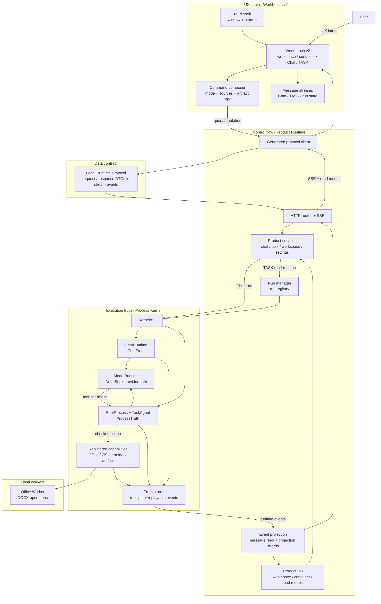

# SuperNova

<p align="center">
  
</p>

<p align="center">
  <strong>A Windows-first desktop AI Workbench for truth-backed agent execution.</strong>
</p>

<p align="center">
  <a href="README.zh-CN.md">中文</a> · English
</p>

<p align="center">
  RC0 stabilization · Windows desktop candidate · Rust Process Kernel · Local Runtime Protocol · Not final release
</p>


## Desktop Preview

<p align="center">
  
</p>

<p align="center"><sub>Screenshot source: current desktop Workbench UI, 2026-06-27.</sub></p>

| Command flow | Source selection |
| --- | --- |
|  |  |

| Model route | Context pack |
| --- | --- |
|  |  |

<p align="center"><sub>Screenshots are UI examples, not validation evidence for a release claim. See <a href="docs/validation.md">Validation</a> for current-state claims.</sub></p>

## What SuperNovaAgent Does

SuperNova is an AI Agent workbench for a local workspace. It brings project files, Chat, TASK execution, context, and output destinations into one surface so questions can become inspectable work results.

Use Chat to quickly understand project files, documents, and code.
Use TASK for longer work: read material, edit code, organize files, run time-limited commands, and generate reports or datasets.
Use containers to keep a work stream's context, history, sources, and output destination together.

### For everyday users

SuperNovaAgent has two user-visible modes. Chat is for reading, explaining, clarifying, and deciding whether a request needs a task. TASK is for controlled local execution with runtime state, receipts, artifacts, and completion evidence.

| What you want to do | What Chat can do first | What TASK can do next |
| --- | --- | --- |
| Understand a project or folder | Read files, directory trees, workspace inventory, hashes, diffs, datasets, Office text, PDF text, and sanitized local environment facts. | Run batch workspace analysis such as SourceSets, duplicate checks, recent-change scans, tree indexes, and performance inventories. |
| Work on code | Read source files, explain module relationships, inspect diffs, and identify likely issue areas. | Apply workspace-scoped file changes, create focused source outputs, copy/move/rename/delete/unzip files, and record what actually changed. |
| Run commands or dev services | Explain the command intent and when terminal execution is needed; Chat itself does not mutate or run task work. | Run bounded foreground commands, start/stop/check long-running services, and attach terminal results to the task timeline. |
| Work with documents and tables | Read DOCX text, workbook cells/text, PDF text, DOCX metadata, validation results, and document diff summaries. | Create DOCX files, rewrite DOCX copies, rewrite DOCX in place when requested, and validate the produced document. |
| Analyze datasets | Read CSV datasets, inspect paged dataset refs, and check coverage. | Export CSV or Markdown results, create temporary datasets, and preserve row counts, schema, and derivation facts in receipts. |
| Produce deliverables | Decide which visible files should be produced and inspect existing artifacts. | Write text artifacts such as Markdown, CSV, JSON, and TXT; copy selected source sets; verify typed artifacts; run coverage and quality checks. |
| Package outputs | Inspect the candidate file set and package shape. | Build zip packages with supporting manifest/checksum files and verify the package artifact. |
| Track what happened | Return an answer, ask for missing facts, or suggest switching to TASK. | Show the active run, task stream, status, artifact cards, completion statement, and evidence in the Workbench. |

### For developers

| Extension path | What you can build on |
| --- | --- |
| Agent workflows | Add TASK flows that observe context, call capabilities, and close with evidence. |
| Local tools | Add or adapt file, terminal, document, package, artifact, or environment capabilities. |
| Product surfaces | Build new Workbench views over the same Product Runtime streams and read models. |
| Runtime contracts | Extend typed protocol DTOs while keeping UI, Product Runtime, and Kernel boundaries explicit. |
| Verification loops | Add validation around the exact layer you changed instead of relying on a model reply. |

SuperNovaAgent is not just a chat box. A chat answer is text; a TASK is tracked local work with runtime state, artifacts, and evidence.

## Product Architecture



| Flow | Meaning |
| --- | --- |
| UX chain | The user works in Workbench v2: workspace, container, Chat, TASK, approvals, artifacts, and settings. |
| Control flow | Product Runtime receives protocol calls, starts Chat/TASK runs, supervises run state, and streams updates. |
| Data flow | Local Runtime Protocol carries typed DTOs; Product DB stores read models; projection shards feed UI messages. |
| Truth flow | Process Kernel owns `ChatTruth`, `ProcessTruth`, receipts, and replayable execution events. |

## Developer Extension Layers

Choose the shallowest layer that matches your change. UI changes should not rewrite runtime truth, and Kernel changes should not leak internal state directly into the Workbench.

| You want to change | Start here | What belongs in this layer | Keep out of this layer |
| --- | --- | --- | --- |
| Workbench experience | `desktop_shell/ui/src/workbench_v2/` | Layout, Chat/TASK surfaces, settings UI, message rendering, local UI state, i18n. | Kernel truth writes, direct workspace mutation, ad-hoc protocol shapes. |
| Desktop shell and packaging | `desktop_shell/src-tauri/` | Tauri window, app icons, installer assets, Windows bundle configuration. | Agent execution rules or product read-model logic. |
| UI/runtime protocol | `crates/local_runtime_protocol/`, `crates/protocol_codegen/`, `desktop_shell/ui/src/protocol/generated/` | Request/response DTOs, stream events, generated TypeScript client/types. | Business decisions that belong in Product Runtime or Kernel. |
| Product APIs and projections | `crates/product_runtime/` | HTTP/SSE routes, services, Product DB read models, run registry, message feed, projection shards, Kernel bridge. | Final execution truth or capability side effects. |
| Agent execution semantics | `process_kernel/` | `ChatRuntime`, `TaskAgent`, model runtime path, registered capabilities, receipts, `ChatTruth`, `ProcessTruth`. | Workbench layout or product-only display preferences. |
| Document worker capability | `office_worker/` plus `process_kernel/src/office_runtime.rs` | Deterministic DOCX operations invoked by Kernel capabilities. | Model reasoning, task planning, or UI projection. |
| Windows installer artifact | `releases/windows/` | Committed NSIS `.exe` packages and installer notes. | Local build caches or `target/` output trees. |

Cross-layer changes should follow this order: update the protocol contract, adapt Product Runtime services/projections, update Workbench consumers, then validate the affected layer. Execution behavior changes should be backed by Kernel receipts/truth events, not only by UI state.

## Quickstart

### Install The Windows App

The committed Windows installer entrypoint is [releases/windows/](releases/windows/). After a new NSIS `.exe` package is built and committed, use that directory as the GitHub navigation point for installing SuperNova.

<p align="center">
  
</p>

### Build From Source

```powershell
cargo check --workspace
npm.cmd --prefix desktop_shell/ui run typecheck
npm.cmd --prefix desktop_shell/ui run build
npm.cmd --prefix desktop_shell/ui run tauri:build
```

The local Tauri build writes the Windows NSIS installer under:

```powershell
Get-ChildItem -LiteralPath desktop_shell/src-tauri/target/release/bundle/nsis -Filter *.exe |
  Sort-Object LastWriteTime -Descending |
  Select-Object -First 1
```

Live provider validation requires local provider configuration. Do not commit API keys, local access material, screenshots with private data, or implementation-level security details.

## Why It Is Interesting

| Focus | What SuperNova does |
| --- | --- |
| Local agent runtime | Runs Chat and TASK workflows through a local desktop runtime rather than a hosted-only surface. |
| Truth-backed execution | Separates model intent, Kernel truth, Product Runtime projection, and UI rendering. |
| Tool-use discipline | Treats provider-native tool calls as intent until registered capabilities record receipts. |
| Product surface | Presents Chat, TASK, approvals, artifacts, settings, and run state in a Windows desktop Workbench. |
| Verification posture | Keeps build/test/current-release claims separate; use the validation guide before making current-state claims. |

## Documentation

- [Desktop User Guide](docs/desktop-user-guide.md)
- [Architecture](docs/architecture.md)
- [Quickstart](docs/quickstart.md)
- [Validation](docs/validation.md)
- [Security Notes](docs/security-model.md)
- [Runtime Contracts](docs/runtime-contracts.md)

## License
SuperNova is licensed under the Apache License, Version 2.0.

## Current Boundary

SuperNova is an RC0 desktop candidate, not a final release. Public docs describe architecture, code navigation, and validation posture; current release claims require fresh verification against the current build.
