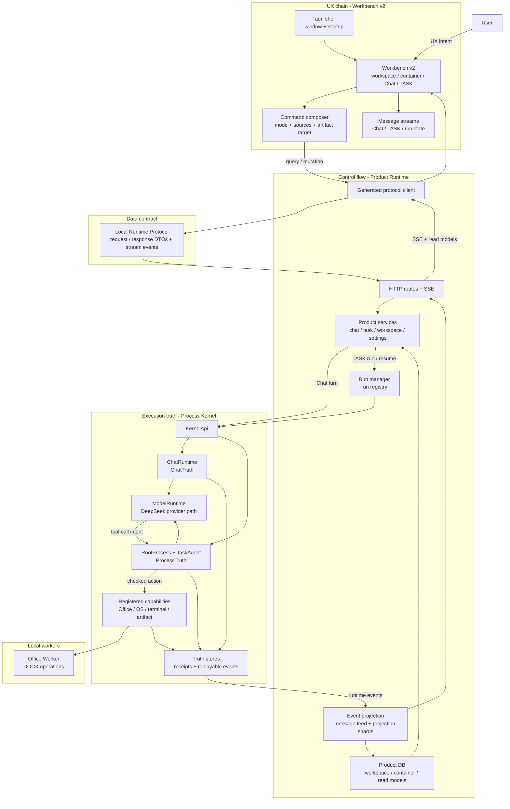

# SuperNova

<p align="center">
  
</p>

<p align="center">
  <strong>面向 Windows 桌面的 AI Workbench，用 Rust Process Kernel 支撑 truth-backed agent execution。</strong>
</p>

<p align="center">
  中文 · <a href="README.md">English</a>
</p>

<p align="center">
  RC0 stabilization · Windows desktop candidate · Rust Process Kernel · Local Runtime Protocol · Not final release
</p>


## 桌面端预览

<p align="center">
  
</p>

<p align="center"><sub>截图来源：当前 desktop Workbench UI，2026-06-27。</sub></p>

| 命令入口 | 来源选择 |
| --- | --- |
|  |  |

| 模型路由 | 上下文包 |
| --- | --- |
|  |  |

<p align="center"><sub>截图只作为 UI 示例，不作为 release claim 的验证证据。当前状态声明请看 <a href="docs/zh-CN/validation.md">验证</a>。</sub></p>

## SuperNovaAgent 能做什么

SuperNova 是面向本地工作区的 AI Agent 工作台。它把项目文件、Chat、TASK 执行、上下文和输出位置放在同一个界面里，帮助你把问题推进成可检查的工作结果。

用 Chat 快速理解项目文件、文档和代码。
用 TASK 处理较长工作：读取资料、修改代码、整理文件、运行有时限命令，生成报告或数据集。
用容器保存一条工作流的上下文、历史、来源和输出位置，方便后续继续追踪。

### 面向大众用户

SuperNovaAgent 有两个用户可见的工作状态：Chat 负责读取、解释、澄清和判断是否需要进入任务；TASK 负责受控执行本地工作，并留下 runtime state、receipts、artifacts 和 completion evidence。

| 你想做什么 | Chat 可以先做什么 | TASK 可以继续做什么 |
| --- | --- | --- |
| 理解一个项目或资料夹 | 读取文件、目录树、workspace inventory、hash、diff、dataset、Office text、PDF text 和脱敏后的本机环境信息。 | 对一批文件做 SourceSet、duplicate check、recent-change scan、tree index 和 performance inventory。 |
| 辅助写代码或改项目 | 阅读源码、解释模块关系、检查 diff，并定位可能的问题区域。 | 在 workspace 边界内写入文件、产出聚焦的 source outputs、复制/移动/重命名/删除/解压文件，并记录实际发生的改动。 |
| 运行命令或开发服务 | 说明命令意图和什么时候需要 terminal execution；Chat 自身不执行 mutation 或 task work。 | 运行有边界的 foreground command，启动/停止/查询长期 service，并把 terminal 结果写入 task timeline。 |
| 处理文档和表格 | 读取 DOCX text、workbook cells/text、PDF text、DOCX metadata、validation result 和 document diff summary。 | 创建 DOCX、另存改写 DOCX、按请求原地改写 DOCX，并校验生成后的文档。 |
| 分析数据集 | 读取 CSV dataset、分页查看 dataset refs，并检查 coverage。 | 导出 CSV 或 Markdown 结果，创建 temporary dataset，并把行数、schema、来源记录到 receipt。 |
| 产出交付物 | 判断应该产出哪些可见文件，并检查已有 artifacts。 | 写出 Markdown、CSV、JSON、TXT 等 text artifacts，复制选定 source set，做 typed artifact verification、coverage check 和 quality audit。 |
| 打包输出结果 | 检查候选文件集合和 package 形态。 | 生成 zip package 以及 manifest/checksum 类辅助文件，并验证 package artifact。 |
| 跟踪发生了什么 | 返回回答、追问缺失信息，或建议切换到 TASK。 | 在 Workbench 中看到 active run、task stream、status、artifact cards、completion statement 和 evidence。 |

### 面向开发者

| 二次开发方向 | 可以复用什么 |
| --- | --- |
| Agent workflows | 基于 TASK loop 扩展“观察上下文、调用能力、带证据完成”的工作流。 |
| Local tools | 增加或改造 file、terminal、document、package、artifact、environment capabilities。 |
| Product surfaces | 基于 Product Runtime streams 和 read models 做新的 Workbench 视图。 |
| Runtime contracts | 扩展 typed protocol DTO，同时保持 UI、Product Runtime、Kernel 边界清晰。 |
| Verification loops | 针对自己改动的层级补验证，而不是只看模型回答。 |

SuperNovaAgent 不只是一个 chat box。关键区别是：Chat answer 只是文本；TASK 是带 runtime state、artifact 和 evidence 的本地工作过程。

## 产品整体架构



| 链路 | 含义 |
| --- | --- |
| UX chain | 用户在 Workbench v2 中操作 workspace、container、Chat、TASK、approval、artifact 和 settings。 |
| Control flow | Product Runtime 接收 protocol call，启动 Chat/TASK run，维护 run state，并通过 SSE 推送更新。 |
| Data flow | Local Runtime Protocol 承载 typed DTO；Product DB 保存 read model；projection shards 支撑 UI message stream。 |
| Truth flow | Process Kernel 拥有 `ChatTruth`、`ProcessTruth`、receipt 和可 replay 的 execution event。 |

## 开发者二次开发层级

改动时优先选择能完成目标的最浅层级。UI 改动不应改写 runtime truth；Kernel 改动也不应把内部状态直接泄露给 Workbench。

| 你想改什么 | 从哪里开始 | 这一层应该负责 | 不应放进这一层 |
| --- | --- | --- | --- |
| Workbench 体验 | `desktop_shell/ui/src/workbench_v2/` | Layout、Chat/TASK surfaces、settings UI、message rendering、local UI state、i18n。 | Kernel truth 写入、直接 workspace mutation、临时拼出来的 protocol shape。 |
| 桌面壳与打包 | `desktop_shell/src-tauri/` | Tauri window、app icons、installer assets、Windows bundle configuration。 | Agent execution rules 或 product read-model logic。 |
| UI/runtime 协议 | `crates/local_runtime_protocol/`, `crates/protocol_codegen/`, `desktop_shell/ui/src/protocol/generated/` | Request/response DTOs、stream events、generated TypeScript client/types。 | 属于 Product Runtime 或 Kernel 的业务判断。 |
| Product APIs 和 projections | `crates/product_runtime/` | HTTP/SSE routes、services、Product DB read models、run registry、message feed、projection shards、Kernel bridge。 | 最终 execution truth 或 capability side effects。 |
| Agent execution semantics | `process_kernel/` | `ChatRuntime`、`TaskAgent`、model runtime path、registered capabilities、receipts、`ChatTruth`、`ProcessTruth`。 | Workbench layout 或 product-only display preferences。 |
| 文档 worker 能力 | `office_worker/` 与 `process_kernel/src/office_runtime.rs` | Kernel capability 调用的 deterministic DOCX operations。 | Model reasoning、task planning 或 UI projection。 |
| Windows 安装包产物 | `releases/windows/` | 已提交的 NSIS `.exe` package 和 installer notes。 | 本地 build cache 或 `target/` output tree。 |

跨层改动建议按这个顺序推进：先更新 protocol contract，再适配 Product Runtime services/projections，再更新 Workbench consumers，最后验证受影响层。执行行为的变化必须能落到 Kernel receipts/truth events，不能只靠 UI state 证明。

## Quickstart

### 安装 Windows App

已提交的 Windows 安装包入口是 [releases/windows/](releases/windows/)。你后续编译并提交新的 NSIS `.exe` 安装包后，这个目录就是 GitHub 首屏导航到安装包的位置。

<p align="center">
  
</p>

### 从源码编译打包

```powershell
cargo check --workspace
npm.cmd --prefix desktop_shell/ui run typecheck
npm.cmd --prefix desktop_shell/ui run build
npm.cmd --prefix desktop_shell/ui run tauri:build
```

本地 Tauri build 会把 Windows NSIS 安装包输出到：

```powershell
Get-ChildItem -LiteralPath desktop_shell/src-tauri/target/release/bundle/nsis -Filter *.exe |
  Sort-Object LastWriteTime -Descending |
  Select-Object -First 1
```

Live provider validation 需要本地 provider configuration。不要提交 API keys、local access material、包含隐私的截图或安全实现细节。

## 为什么值得看

| 重点 | SuperNova 的做法 |
| --- | --- |
| Local agent runtime | Chat 和 TASK 通过本地桌面 runtime 运行，而不是只停留在 hosted chat surface。 |
| Truth-backed execution | 分离 model intent、Kernel truth、Product Runtime projection 和 UI rendering。 |
| Tool-use discipline | provider-native tool call 只是 intent，必须由 registered capability 产生 receipt 后才进入事实层。 |
| Product surface | 在 Windows Workbench 中呈现 Chat、TASK、approval、artifact、settings 和 run state。 |
| Verification posture | build/test/current-release claim 分开处理；当前状态声明必须先按 validation guide 重新验证。 |

## Documentation

- [桌面端用户指南](docs/zh-CN/desktop-user-guide.md) / [Desktop User Guide](docs/desktop-user-guide.md)
- [架构](docs/zh-CN/architecture.md) / [Architecture](docs/architecture.md)
- [快速开始](docs/zh-CN/quickstart.md) / [Quickstart](docs/quickstart.md)
- [验证](docs/zh-CN/validation.md) / [Validation](docs/validation.md)
- [安全说明](docs/zh-CN/security-model.md) / [Security Notes](docs/security-model.md)
- [Runtime Contracts](docs/zh-CN/runtime-contracts.md) / [Runtime Contracts](docs/runtime-contracts.md)

## License
SuperNova 使用 Apache License, Version 2.0 开源。

## 当前边界

SuperNova 当前是 RC0 desktop candidate，不是 final release。公开材料描述架构、源码导航和验证姿态；任何当前 release claim 都需要基于当前 build 重新验证。
