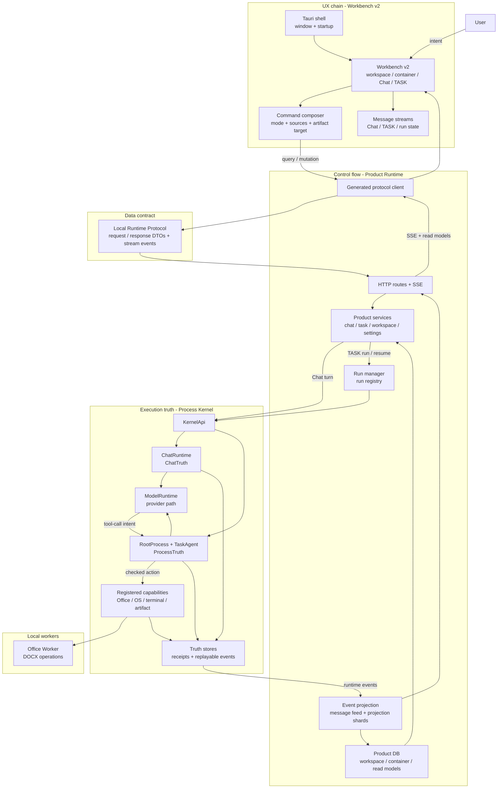
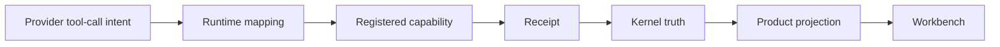

# Architecture

[中文](zh-CN/architecture.md) | English

SuperNova is a Windows desktop AI Workbench built around a local runtime boundary. The user works in Workbench v2; Product Runtime handles product APIs, projections, and run supervision; Local Runtime Protocol defines typed DTOs; Process Kernel owns execution truth.

## System Map

## Layers

| Layer | Source path | Role |
| --- | --- | --- |
| Workbench v2 | `desktop_shell/ui/src/workbench_v2/` | React/Tauri product surface for workspace, container, Chat, TASK, settings, run state, and artifacts. |
| Tauri shell | `desktop_shell/src-tauri/` | Desktop window, app packaging, static assets, and Windows installer configuration. |
| Product Runtime | `crates/product_runtime/` | Local HTTP/SSE service, product state, run supervision, event projection, and Kernel bridge. |
| Local Runtime Protocol | `crates/local_runtime_protocol/` | Typed request/response and stream-event boundary consumed by Workbench. |
| Process Kernel | `process_kernel/` | Chat/TASK execution authority, model runtime path, capability execution, receipts, and truth stores. |
| Office Worker | `office_worker/` | Local document worker used by Kernel Office capability operations. |

## Flow Types

| Flow | Description |
| --- | --- |
| UX flow | The user works through Workbench v2. UI state covers selection, drafts, display mode, and visible streams. |
| Control flow | Product Runtime receives requests, starts Chat/TASK work, supervises runs, and streams product-facing updates. |
| Data flow | Local Runtime Protocol DTOs keep the UI/runtime boundary typed. Product DB and projection shards store read models for the UI. |
| Truth flow | Process Kernel records `ChatTruth`, `ProcessTruth`, capability receipts, and replayable execution events. |

## Chat And TASK

| Dimension | Chat | TASK |
| --- | --- | --- |
| Purpose | Conversation, read-only inspection, clarification, or suggesting a task. | Controlled agent work that may produce artifacts or workspace changes. |
| Kernel runtime | `ChatRuntime` | `RootProcess` + `TaskAgent` |
| Truth domain | `ChatTruth` | `ProcessTruth` |
| UI surface | Chat stream | TASK stream, run state, artifact cards, approvals where applicable |
| Completion evidence | Chat control decision and transcript facts. | Kernel receipts, truth events, and deliverable evidence. |

## Tool Intent Boundary

Provider-native tool calls are treated as model intent. They do not become completed work until the runtime maps the intent to a registered capability, executes it inside the Kernel boundary, and records a receipt.

## Read Next

- [Runtime Contracts](runtime-contracts.md)
- [Quickstart](quickstart.md)
- [Validation](validation.md)
