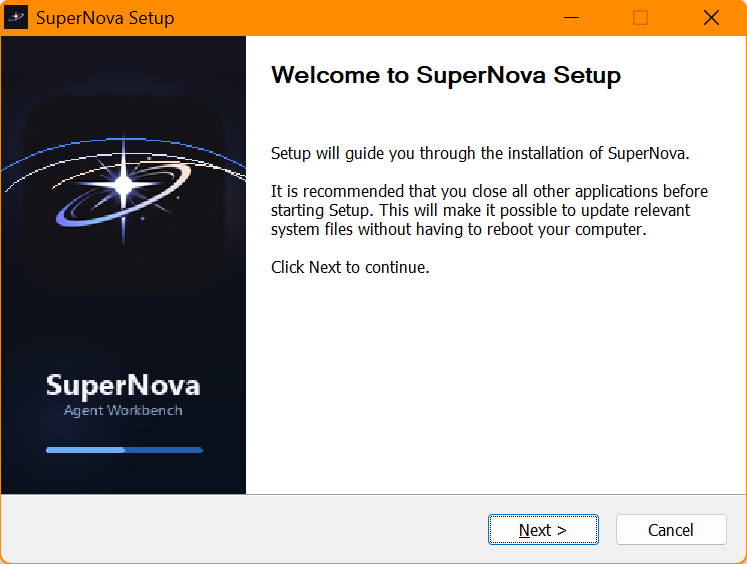

# Desktop User Guide

[中文](zh-CN/desktop-user-guide.md) | English

This guide is for people using the SuperNova Windows desktop Workbench. It explains the product surface, not the internal runtime implementation.

SuperNova is currently an RC0 desktop candidate. Use this guide to understand the intended desktop workflow; use [Validation](validation.md) before making any current release-readiness claim.

Screenshots below are UI examples captured from the current desktop Workbench or Windows installer on 2026-06-27. They are not release validation evidence.

## First Run

1. Install the Windows app from [releases/windows/](../releases/windows/), or build it from source with [Quickstart](quickstart.md).
2. Launch SuperNova and wait for the startup screen to finish:
   - Opening SuperNova shell.
   - Starting Product Runtime.
   - Checking Process Kernel.
   - Loading workspace history.
   - Applying desktop settings.
3. Open **System Settings**.
4. In **Provider API**, configure the provider credential and run **Test** before starting real Chat or TASK work.
5. In **Appearance**, choose language and theme.
6. Add a workspace, then create a container for a focused work stream.

Do not commit provider keys, screenshots with private data, local paths, or local access material.

  

| Dark startup | Light startup |
| --- | --- |
|  |  |

## Workbench Concepts

| Concept | Meaning |
| --- | --- |
| Workspace | The local project or folder root SuperNova can work inside. Workspace-scoped capabilities should stay inside this boundary. |
| Container | A focused work stream inside a workspace. It keeps related Chat, TASK, context, sources, output choices, and history together. |
| Chat | A non-mutating mode for reading, explaining, clarifying, and deciding whether the request needs TASK execution. |
| TASK | A controlled execution mode for multi-step work, tool calls, file changes, command runs, artifacts, and completion evidence. |
| Sources | Optional `@` references that guide the model toward selected files, folders, or previous Chat/TASK history. |
| Output Destination | Optional `$` destination guidance for generated artifacts. It guides outputs; runtime receipts still decide what actually exists. |
| Artifact | A user-visible output such as Markdown, CSV, JSON, TXT, DOCX, or a package created by a registered capability. |
| Receipt | Runtime evidence that a registered capability actually ran and what it produced. |

  

## Main Workflow

1. Select or create a workspace from the **PROJECTS** rail.
2. Create or select a container.
3. Use the composer in **Chat** for quick questions, explanation, and inspection.
4. Switch to **TASK** when the request needs local execution, files, commands, documents, or artifacts.
5. Add `@` sources when you want the agent to focus on specific files, folders, or history.
6. Set `$` output destination when generated artifacts should go to a particular workspace folder.
7. Review the task stream, status, artifacts, receipts, and completion statement before treating work as done.

You can switch modes with `/chat` and `/task` in the composer. The model and context flyouts are available from the Workbench toolbar or slash commands.

  

## Chat Mode

Use Chat when you want SuperNova to:

- Explain a codebase, folder, or document set.
- Read selected files, directory listings, diffs, datasets, Office text, PDF text, or sanitized local environment facts.
- Ask a clarification question before acting.
- Suggest moving to TASK when the request needs mutation, terminal execution, long-running work, or artifact delivery.

Chat should not claim that it changed files, ran commands, or completed a task. Those belong in TASK.

## TASK Mode

Use TASK when you want SuperNova to perform controlled local work:

| Goal | TASK can do |
| --- | --- |
| Code and file work | Apply workspace-scoped file changes, copy, move, rename, delete, unzip, and record actual changes. |
| Workspace analysis | Build SourceSets, page through file sets, find duplicates, inspect recent changes, build tree indexes, and create performance inventories. |
| Commands and services | Run bounded foreground commands, start/stop/check managed local services, and attach terminal results to the task timeline. |
| Documents | Read, validate, create, rewrite, and diff DOCX files through the Office worker path; inspect workbook/PDF text where supported. |
| Datasets | Read CSV data, export CSV or Markdown, create temporary datasets, and preserve schema/row-count facts. |
| Artifacts | Write user-visible Markdown, CSV, JSON, TXT, DOCX, or package outputs through registered capabilities. |
| Packaging | Build zip packages with supporting manifest/checksum files and verify package artifacts. |

TASK work is visible through the task stream, status rail, artifact cards, receipts, and final completion statement.

## Sources And Output

Use **Sources** when the task should prefer specific context:

- Workspace folders.
- Workspace files.
- Previous Chat history.
- Previous TASK history.

Use **Output Destination** when deliverables should be placed in a specific workspace folder. This is guidance for output placement; after a TASK completes, inspect artifact cards and receipts to confirm what was actually created.

  

## Model And Context

The **Model** flyout controls the provider route, model, thinking mode, reasoning effort, and output token budget.

The **Context** flyout controls how much recent Chat/TASK history and selected context enters the next request. It can prefer compact summaries, reference-only entries, or fuller context depending on the selected item.

For current provider behavior, run the live provider test from **Provider API** settings. Do not use mock or fallback behavior as proof of live-provider readiness.

| Model configuration | Context configuration |
| --- | --- |
|  |  |

## Artifacts And Evidence

After a TASK, check:

1. The task status is completed, blocked, failed, interrupted, cancelled, or waiting for input.
2. Artifact cards list the user-visible outputs you expected.
3. Receipts exist for important file, document, terminal, dataset, or package actions.
4. The completion statement names the produced artifacts and any known limitations.
5. The files exist in the workspace or selected output destination.

If the model says something was created but no artifact or receipt exists, treat the runtime evidence as authoritative.

## Common Use Cases

| Use case | Recommended path |
| --- | --- |
| Understand a repo | Start in Chat, select `@` files or folders, ask for structure and risks. Move to TASK only if changes or deliverables are needed. |
| Make a focused code change | Use TASK, name the target files and expected behavior, then inspect the diff and receipts. |
| Generate a report | Use TASK, select sources, set an output destination, and review the produced artifact. |
| Work with DOCX | Use TASK for create/rewrite operations; check validation and artifact cards after completion. |
| Run a build or local command | Use TASK. Keep commands bounded and review terminal results in the task stream. |
| Package deliverables | Use TASK with an explicit source set and package destination; verify the zip and manifest/checksum outputs. |

## Troubleshooting

| Symptom | What to check |
| --- | --- |
| Composer is disabled | Select or create a container. A container is required for Chat/TASK work. |
| Provider call fails | Open **System Settings -> Provider API**, confirm the key is saved, and run **Test**. |
| TASK is waiting | Look for clarification, approval, failure, or input messages in the task stream. |
| No artifact appears | Check whether the request asked for an output artifact, whether `$` output destination was set, and whether receipts show a create/export/package action. |
| A run looks stale | Refresh runtime state. Use force close only when the user-facing run is clearly stale and you understand that it does not prove external work completed. |
| Screenshot or report contains private data | Redact it before sharing or committing. Never publish provider keys, local usernames, private paths, or local access material. |

## Boundaries

SuperNova is a local desktop agent workbench, not unrestricted control of the computer. It works through registered runtime capabilities, workspace boundaries, and receipts.

Public documentation should not claim final release readiness, broad security completion, or live-provider verification without a current run against the current build.

## Next Reads

- [Quickstart](quickstart.md)
- [Validation](validation.md)
- [Security Notes](security-model.md)
- [Runtime Contracts](runtime-contracts.md)
