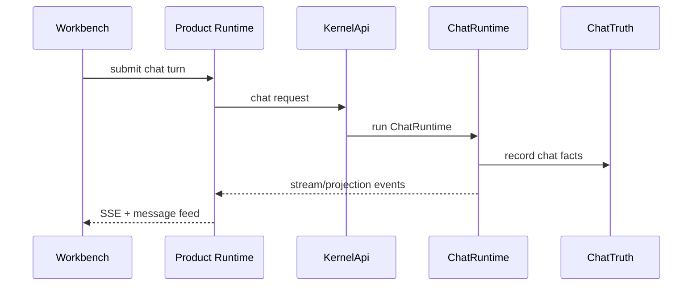

# Chat Request Lifecycle

[中文](../zh-CN/module-contracts/request-lifecycle-chat.md) | English

Chat is non-mutating. If a request needs workspace mutation, terminal execution, or artifact delivery, it belongs to TASK semantics.

