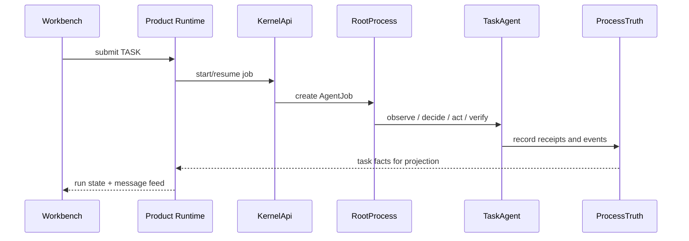

# TASK Request Lifecycle

[中文](../zh-CN/module-contracts/request-lifecycle-task.md) | English

TASK is the mutation-capable execution path. Completion claims require Kernel facts and receipts, not UI projection alone.

