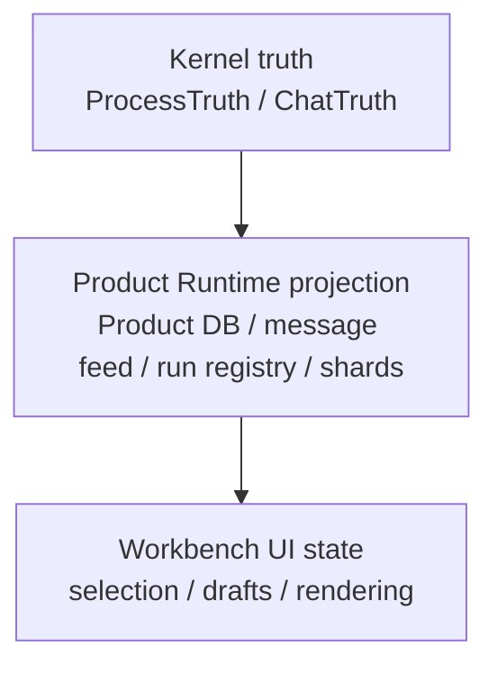

# State And Truth Boundaries

[中文](../zh-CN/module-contracts/state-and-truth-boundaries.md) | English

SuperNova separates execution truth from product projection and UI-local state.

## Boundary Table

| Layer | Owns | Does not own |
| --- | --- | --- |
| Kernel truth | Execution facts, receipts, replayable events. | Product layout, UI drafts. |
| Product Runtime projection | Product read models, run supervision, stream fanout. | Authoritative task execution facts. |
| Workbench UI | User interaction, local display state. | Runtime truth or capability execution. |
| Reports | Historical evidence artifacts. | Current build proof unless freshly rerun. |

