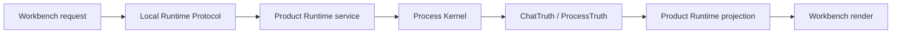

# Runtime Contracts

[中文](zh-CN/runtime-contracts.md) | English

Runtime contracts define which layer owns a fact, which layer may project it, and which layer may display it. This is the core rule behind SuperNova's agent runtime.

## Contract Summary

| Contract | Owner | Purpose |
| --- | --- | --- |
| `ChatTruth` | Process Kernel | Chat turn facts, read-only receipts, and provider transcript facts. |
| `ProcessTruth` | Process Kernel | TASK execution facts, capability receipts, artifact evidence, and closure state. |
| Product DB | Product Runtime | Product read models for workspaces, containers, messages, runs, and projections. |
| `run_registry` | Product Runtime | Run supervision state for Chat/TASK work visible to the product. |
| `message_feed` | Product Runtime | User-visible message stream projection. |
| `projection_shards` | Product Runtime | High-frequency projection storage partitioned by Chat/TASK identity. |
| Local Runtime Protocol | Protocol crate | Typed UI/runtime DTO and stream-event boundary. |
| Workbench UI state | Workbench v2 | Drafts, selections, flyouts, display language, and rendering state. |

## Core Invariants

- Execution truth is not UI projection.
- Product projection is not Kernel truth.
- Provider tool calls are intent, not completed work.
- Workspace changes must be represented by registered capability execution and receipts.
- Current-state claims must be backed by current validation.

## Request Lifecycle

## Chat Contract

Chat is the conversation path. It can answer, clarify, inspect read-only context, or suggest a TASK. Chat facts are stored in `ChatTruth`; Workbench renders a projection of those facts.

Chat should not be described as the owner of workspace mutation.

## TASK Contract

TASK is the controlled agent execution path. A TASK can run a Kernel loop, call registered capabilities, produce artifacts, and close with evidence. TASK facts are stored in `ProcessTruth`.

A visible TASK card in the UI is a projection. The execution fact remains in Kernel truth.

## Product Runtime Contract

Product Runtime is the desktop-facing service layer. It owns routes, run supervision, Product DB, SSE streams, and projection. It does not replace Kernel truth.

## Workbench Contract

Workbench is the user-facing surface. It owns drafts, selections, display preferences, and rendering. It consumes runtime DTOs and streams; it does not decide that a task completed by itself.

## Practical Rule For Contributors

When adding or reviewing a feature, ask four questions:

1. Which layer owns the fact?
2. Which layer projects the fact?
3. Which layer renders the fact?
4. What validation proves the claim for the current build?
