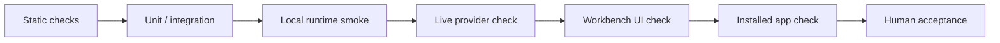

# Validation

[中文](zh-CN/validation.md) | English

Validation is layered. A command can prove one layer without proving the whole desktop product. Use this page when you want to make a current-state claim about a build.

## Validation Ladder



## What To Run

| Claim | Minimum evidence |
| --- | --- |
| Rust workspace compiles | `cargo check --workspace` |
| Workbench TypeScript is valid | `npm.cmd --prefix desktop_shell/ui run typecheck` |
| Workbench production assets build | `npm.cmd --prefix desktop_shell/ui run build` |
| Windows package builds | `npm.cmd --prefix desktop_shell/ui run tauri:build` |
| Local runtime behavior works | A scoped Product Runtime smoke against the current build. |
| Live provider path works | A current live-provider run using local configuration, with no fallback substituted for the provider. |
| Installed desktop app works | Install the freshly built `.exe`, launch it, and replay the target workflow. |

## Baseline Command Set

```powershell
cargo check --workspace
npm.cmd --prefix desktop_shell/ui run typecheck
npm.cmd --prefix desktop_shell/ui run build
npm.cmd --prefix desktop_shell/ui run tauri:build
```

Run narrower tests only when the claim is narrow. Do not use a narrow focused test to imply that the full product is ready.

## Current-State Claim Rules

Use precise wording:

| Say | Do not say |
| --- | --- |
| "The Rust workspace compiles with `cargo check --workspace`." | "The app is fully verified." |
| "The Workbench build passed." | "The installed app is ready." |
| "The installer was produced." | "Release validation is complete." |
| "The live provider path was checked in this run." | "Real provider support is verified" without a current run. |

## Installed App Checklist

Before calling a Windows build release-ready, validate the installed app, not only the development build:

1. Build the NSIS package.
2. Install the generated `.exe`.
3. Launch SuperNova from the installed app.
4. Confirm Workbench startup and Product Runtime connectivity.
5. Run the specific Chat/TASK workflow you want to claim.
6. Confirm UI projection, run state, and produced artifacts where relevant.

## Security Boundary

Validation logs, screenshots, and copied terminal output must not include provider keys, private paths, local access material, or implementation-level security details.
