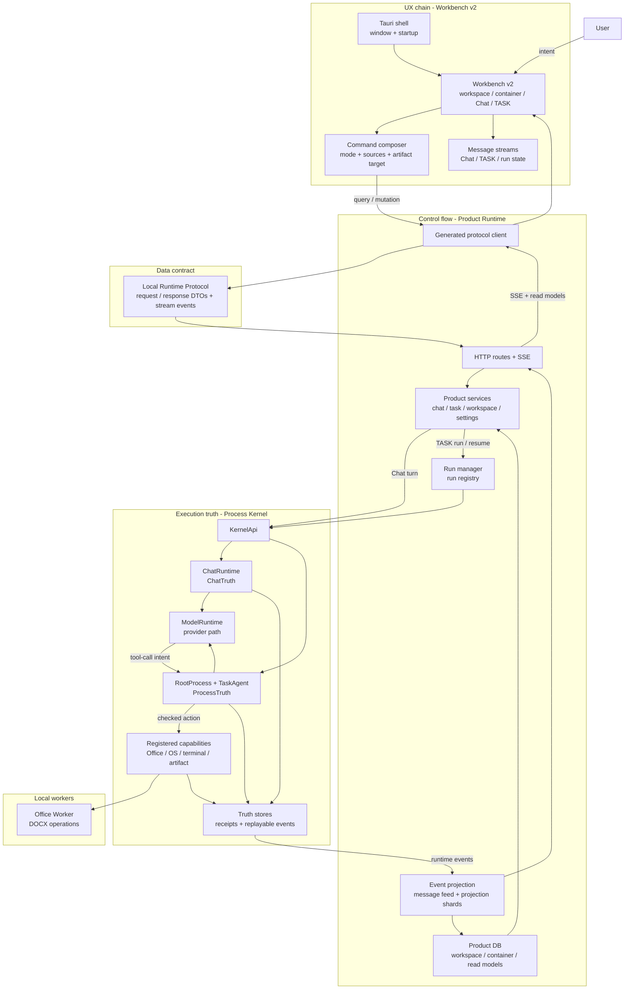
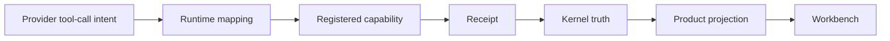

# 架构

[English](../architecture.md) | 中文

SuperNova 是一个 Windows 桌面 AI Workbench，核心是本地 runtime boundary。用户在 Workbench v2 中操作；Product Runtime 负责产品 API、projection 和 run supervision；Local Runtime Protocol 定义 typed DTO；Process Kernel 拥有 execution truth。

## 系统总览

## 层级

| 层 | Source path | 角色 |
| --- | --- | --- |
| Workbench v2 | `desktop_shell/ui/src/workbench_v2/` | React/Tauri 产品界面，覆盖 workspace、container、Chat、TASK、settings、run state 和 artifact。 |
| Tauri shell | `desktop_shell/src-tauri/` | 桌面窗口、应用打包、静态资源和 Windows installer 配置。 |
| Product Runtime | `crates/product_runtime/` | 本地 HTTP/SSE service、product state、run supervision、event projection 和 Kernel bridge。 |
| Local Runtime Protocol | `crates/local_runtime_protocol/` | Workbench 消费的 typed request/response 和 stream-event boundary。 |
| Process Kernel | `process_kernel/` | Chat/TASK execution authority、model runtime path、capability execution、receipts 和 truth stores。 |
| Office Worker | `office_worker/` | Kernel Office capability 使用的本地文档 worker。 |

## 四类链路

| 链路 | 说明 |
| --- | --- |
| UX flow | 用户通过 Workbench v2 操作。UI state 只覆盖选择、草稿、显示模式和可见 stream。 |
| Control flow | Product Runtime 接收请求，启动 Chat/TASK，监督 run，并推送产品可见更新。 |
| Data flow | Local Runtime Protocol DTO 保持 UI/runtime 边界类型化；Product DB 和 projection shards 保存 UI read model。 |
| Truth flow | Process Kernel 记录 `ChatTruth`、`ProcessTruth`、capability receipts 和可 replay 的 execution events。 |

## Chat 与 TASK

| 维度 | Chat | TASK |
| --- | --- | --- |
| 目的 | 对话、read-only inspection、澄清或建议 task。 | 受控 agent work，可能产生 artifact 或 workspace change。 |
| Kernel runtime | `ChatRuntime` | `RootProcess` + `TaskAgent` |
| Truth domain | `ChatTruth` | `ProcessTruth` |
| UI surface | Chat stream | TASK stream、run state、artifact cards、必要时 approval。 |
| 完成证据 | Chat control decision 和 transcript facts。 | Kernel receipts、truth events 和 deliverable evidence。 |

## Tool Intent Boundary

Provider-native tool call 只是 model intent。它必须被 runtime 映射到 registered capability，在 Kernel boundary 内执行，并记录 receipt，之后才进入 execution truth。

## 继续阅读

- [Runtime Contracts](runtime-contracts.md)
- [Quickstart](quickstart.md)
- [Validation](validation.md)
