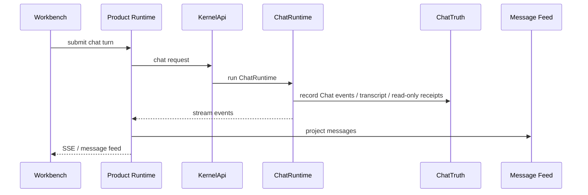

# Chat Request Lifecycle

[English](../../module-contracts/request-lifecycle-chat.md) | 中文

Chat lifecycle 的关键是：ChatRuntime 可以回答、澄清、建议 TASK，或调用 read-only tools；它不承担 workspace mutation。

## 步骤

1. Workbench 从 composer 收集 draft、mode、container context。
2. `protocol/chatQueries.ts` 通过 generated client 调用 Product Runtime。
3. Product Runtime `http/routes/chat.rs` 把请求交给 `services/chat_service.rs`。
4. service 层绑定 workspace/container/thread context，并通过 Kernel bridge 调用 `KernelApi`。
5. `KernelApi` 创建或恢复 `ChatRuntime`。
6. `ChatRuntime` 调用 provider，并把 transcript、answer、read-only tool receipt 写入 `ChatTruth`。
7. Product Runtime 把 stream event 与 truth-derived result 投影到 message feed。
8. Workbench 通过 SSE/query 读取消息并渲染。

## 不变量

- Chat 不执行破坏性 workspace mutation。
- read-only tool receipt 属于 Chat truth，但不等于 TASK artifact。
- Chat answer delta 是 display/projection event；最终事实要回到 `ChatTruth`。
- 如果用户目标需要文件修改、terminal execution、artifact delivery 或 approval，应进入 TASK。

## 阅读起点

| 层 | 文件 |
| --- | --- |
| UI submit/render | `desktop_shell/ui/src/workbench_v2/protocol/chatQueries.ts`, `chat/*`, `main/streamMessages.ts` |
| Product route/service | `crates/product_runtime/src/http/routes/chat.rs`, `services/chat_service.rs` |
| Kernel API/runtime | `process_kernel/src/kernel_api.rs`, `process_kernel/src/chat_runtime.rs` |
| Truth | `process_kernel/src/chat_truth.rs` |

