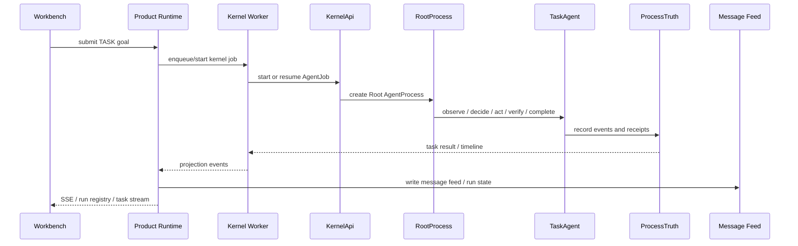

# TASK Request Lifecycle

[English](../../module-contracts/request-lifecycle-task.md) | 中文

TASK lifecycle 的关键是：模型只产生 intent，真实执行必须经过 Kernel capability contract，并把结果记录到 `ProcessTruth`。

## 步骤

1. Workbench 在 TASK mode 下提交 goal。
2. `protocol/taskQueries.ts` 通过 generated client 调用 Product Runtime。
3. Product Runtime `http/routes/tasks.rs` 把请求交给 `services/task_service.rs`。
4. `task_service` 绑定 workspace/container/run context，写入 run registry，并通过 Kernel worker 调用 Kernel。
5. `KernelApi` 创建或恢复 `AgentJob`。
6. `RootProcess` / `TaskAgent` 进入 observe / decide / act / verify / complete loop。
7. provider-native tool call 被视为 model intent；Kernel 只执行 registered capability。
8. capability result、artifact result、approval decision、completion evidence 写入 `ProcessTruth`。
9. Product Runtime 把 Kernel/runtime event 投影为 message feed、run status、task rail、artifact card。
10. Workbench 渲染投影，但不自行判定执行事实。

## 不变量

- TASK completion 需要 Kernel truth 支撑。
- provider tool call 不等于工具已经执行。
- Product Runtime run state 是产品监督层，不是 `ProcessTruth` 的替代品。
- artifact card 是 UI projection，artifact 是否可交付需要 evidence/receipt。
- approval 是 runtime contract，不是 prompt convention。
- 公开文档只描述职责边界，不展开内部安全控制细节。

## 阅读起点

| 层 | 文件 |
| --- | --- |
| UI submit/render | `desktop_shell/ui/src/workbench_v2/protocol/taskQueries.ts`, `task/*`, `layout/TaskStatusRail.tsx` |
| Product route/service | `crates/product_runtime/src/http/routes/tasks.rs`, `services/task_service.rs`, `services/run_manager.rs` |
| Kernel bridge | `crates/product_runtime/src/kernel_worker.rs`, `kernel/kernel_bridge.rs`, `kernel/event_projection.rs` |
| Kernel API/runtime | `process_kernel/src/kernel_api.rs`, `root_process.rs`, `task_agent.rs`, `task_agent_runtime.rs` |
| Truth/capability | `process_kernel/src/lib.rs`, `capability_kernel.rs`, `artifact_runtime.rs`, `closure_gate.rs` |

