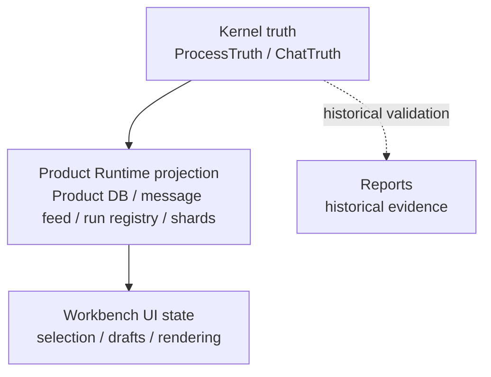

# State And Truth Boundaries

[English](../../module-contracts/state-and-truth-boundaries.md) | 中文

SuperNova 的核心分层是 execution truth、product projection、UI-local state 三者分离。

## 分层表

| 层 | 拥有 | 不拥有 |
| --- | --- | --- |
| Kernel truth | execution facts、receipts、replayable events、closure evidence。 | UI draft、布局、首屏展示、产品读模型优化。 |
| Product Runtime projection | Product DB、message feed、run registry、runtime event log、projection shards。 | TASK 是否真实完成、artifact 是否真实产生、capability 是否真实执行。 |
| Workbench UI state | selected workspace/container、draft、flyout、theme、language、rendering state。 | Kernel truth、capability execution、provider credential secret。 |
| Reports | 历史验证证据、测试输出、installed-app replay 记录。 | 当前 worktree 刚刚通过的证明，除非重新运行。 |

## 不变量

- truth 可以向 projection 派生；projection 不能反向覆盖 truth。
- UI 可以请求 runtime 操作；UI 不能直接写 execution fact。
- streaming delta 可以显示模型输出进度；不能替代 closure evidence。
- run registry 可以描述 run lifecycle；不能替代 `ProcessTruth`。
- historical evidence 必须带日期和范围；不能写成 current verification。

## 读代码检查点

| 想确认的问题 | 起点 |
| --- | --- |
| Chat facts 如何存储 | `process_kernel/src/chat_truth.rs` |
| TASK facts 如何进入 Kernel truth | `process_kernel/src/kernel_api.rs`, `process_kernel/src/task_agent.rs` |
| Product Runtime 如何投影事件 | `crates/product_runtime/src/kernel/event_projection.rs` |
| message feed 如何落盘 | `crates/product_runtime/src/state/message_feed.rs` |
| run state 如何展示 | `crates/product_runtime/src/state/run_registry.rs`, `desktop_shell/ui/src/workbench_v2/main/runStatus.ts` |
| UI 如何过滤/渲染消息 | `desktop_shell/ui/src/workbench_v2/main/streamMessages.ts`, `rendering/*` |

