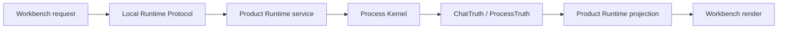

# Runtime Contracts

[English](../runtime-contracts.md) | 中文

Runtime contract 定义哪个层拥有事实、哪个层可以投影事实、哪个层可以展示事实。这是 SuperNova agent runtime 的核心规则。

## Contract Summary

| Contract | Owner | Purpose |
| --- | --- | --- |
| `ChatTruth` | Process Kernel | Chat turn facts、read-only receipts、provider transcript facts。 |
| `ProcessTruth` | Process Kernel | TASK execution facts、capability receipts、artifact evidence、closure state。 |
| Product DB | Product Runtime | workspace、container、message、run、projection 的 product read models。 |
| `run_registry` | Product Runtime | 产品可见的 Chat/TASK run supervision state。 |
| `message_feed` | Product Runtime | 用户可见 message stream projection。 |
| `projection_shards` | Product Runtime | 按 Chat/TASK identity 分片的高频 projection storage。 |
| Local Runtime Protocol | Protocol crate | UI/runtime typed DTO 和 stream-event boundary。 |
| Workbench UI state | Workbench v2 | drafts、selections、flyouts、display language、rendering state。 |

## 核心不变量

- Execution truth 不是 UI projection。
- Product projection 不是 Kernel truth。
- Provider tool call 是 intent，不是 completed work。
- Workspace change 必须由 registered capability execution 和 receipt 表示。
- 当前状态 claim 必须由当前验证支撑。

## Request Lifecycle

## Chat Contract

Chat 是对话路径。它可以回答、澄清、检查 read-only context，或建议进入 TASK。Chat facts 存在 `ChatTruth`；Workbench 渲染这些 facts 的 projection。

Chat 不应被描述成 workspace mutation 的 owner。

## TASK Contract

TASK 是受控 agent execution path。TASK 可以运行 Kernel loop、调用 registered capabilities、生成 artifacts，并用 evidence closure。TASK facts 存在 `ProcessTruth`。

UI 中可见的 TASK card 是 projection。执行事实仍然属于 Kernel truth。

## Product Runtime Contract

Product Runtime 是面向桌面的 service layer。它拥有 routes、run supervision、Product DB、SSE streams 和 projection。它不替代 Kernel truth。

## Workbench Contract

Workbench 是用户界面。它拥有 drafts、selections、display preferences 和 rendering。它消费 runtime DTOs 和 streams；它不能自行判定 task completed。

## Contributor Practical Rule

新增或 review 功能时，先问四个问题：

1. 哪一层拥有事实？
2. 哪一层投影事实？
3. 哪一层渲染事实？
4. 什么验证能证明当前 build 的 claim？
