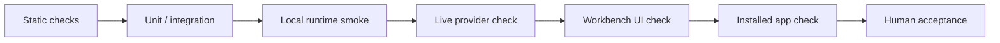

# 验证

[English](../validation.md) | 中文

SuperNova 的验证是分层的。一个命令只能证明它覆盖的层级，不能自动证明整个桌面产品可发布。需要声明当前 build 状态时，按本文选择证据。

## 验证梯度



## 应该运行什么

| Claim | 最小证据 |
| --- | --- |
| Rust workspace 可以编译 | `cargo check --workspace` |
| Workbench TypeScript 有效 | `npm.cmd --prefix desktop_shell/ui run typecheck` |
| Workbench production assets 可构建 | `npm.cmd --prefix desktop_shell/ui run build` |
| Windows package 可构建 | `npm.cmd --prefix desktop_shell/ui run tauri:build` |
| Local runtime 行为可用 | 针对当前 build 的 Product Runtime smoke。 |
| Live provider path 可用 | 使用本地配置完成当前 live-provider run，不能用 fallback 代替 provider。 |
| Installed desktop app 可用 | 安装最新 `.exe`，启动后 replay 目标工作流。 |

## 基线命令

```powershell
cargo check --workspace
npm.cmd --prefix desktop_shell/ui run typecheck
npm.cmd --prefix desktop_shell/ui run build
npm.cmd --prefix desktop_shell/ui run tauri:build
```

只有 claim 范围很窄时，才使用 narrower focused tests。不能用窄测试暗示整个产品 ready。

## 当前状态声明规则

| 可以说 | 不要说 |
| --- | --- |
| “Rust workspace 已通过 `cargo check --workspace`。” | “整个 app 已完整验证。” |
| “Workbench build 通过。” | “installed app 已 ready。” |
| “installer 已生成。” | “release validation 已完成。” |
| “本次运行检查了 live provider path。” | 没有当前运行就说 “real provider support verified”。 |

## Installed App Checklist

要称一个 Windows build release-ready，必须验证安装态 app，而不只是开发构建：

1. 构建 NSIS package。
2. 安装生成的 `.exe`。
3. 从 installed app 启动 SuperNova。
4. 确认 Workbench startup 和 Product Runtime connectivity。
5. 运行你要声明的 Chat/TASK workflow。
6. 确认 UI projection、run state，以及相关 artifact。

## 安全边界

验证日志、截图和复制的终端输出不能包含 provider keys、private paths、local access material 或实现级安全细节。
